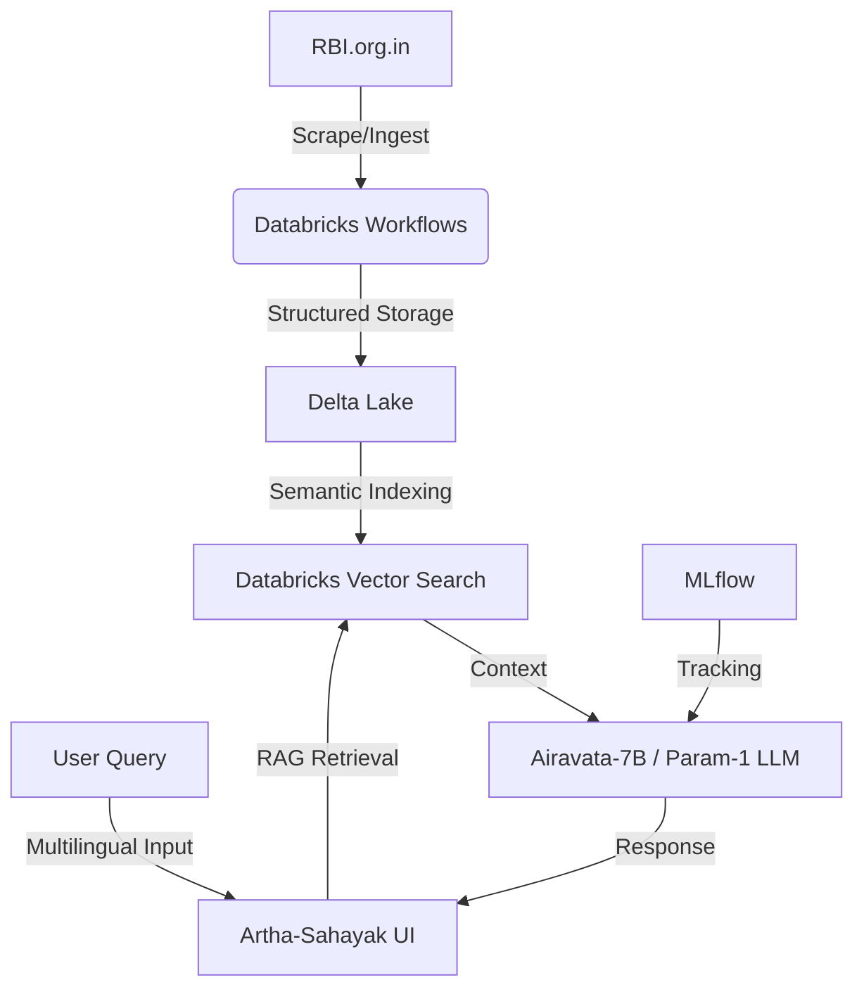

# RBI Artha-Sahayak: AI-Powered Financial Assistant
**Bharat Bricks Hackathon 2026 - IIT Delhi**

## 1. Project Write-up (Submission Text)
RBI Artha-Sahayak is an AI-powered assistant designed to democratize access to complex financial data. Built on Databricks Lakehouse, it ingests real-time RBI circulars and statistical handbooks into Delta Lake, using a RAG (Retrieval-Augmented Generation) pipeline to provide multilingual explanations (Hindi/English). It helps citizens and small businesses navigate the evolving Indian financial landscape with ease, ensuring financial inclusion through intelligent data accessibility.

## 2. Architecture Diagram

## 3. Technologies & Models Used
- **Core Platform**: Databricks Free Edition (Lakehouse Architecture)
- **Data Storage**: Delta Lake (for versioned, reliable document storage)
- **AI/ML**: 
    - **Airavata-7B**: Preferred Indian model for Hindi/Indic language support.
    - **Gemini 3 Flash**: For high-speed reasoning and orchestration.
    - **Databricks Vector Search**: For semantic retrieval of circular content.
- **Frontend**: Databricks App (React + Tailwind CSS)
- **Data Engineering**: Apache Spark / PySpark for real-time scraping and ingestion.

## 4. How to Run
1. **Clone the Repository**: `git clone <repo-url>`
2. **Install Dependencies**: `npm install`
3. **Set Environment Variables**: Add your `GEMINI_API_KEY` to the `.env` file.
4. **Start the Application**: `npm run dev`
5. **Ingest Data**: Click "Sync with RBI" to populate the Delta Lake registry.
6. **Chat**: Use the Artha-Sahayak AI window to ask questions about the ingested documents.

## 5. Demo Steps
1. **Sync Data**: Click the "Sync with RBI" button. Observe the "Delta Lake Storage" count increase as documents are ingested.
2. **Ask a Question**: Type "What are the latest trends in the Indian economy?" or "Explain the recent circular on UPI."
3. **Multilingual Test**: Ask a question in Hindi, e.g., "भारतीय अर्थव्यवस्था के बारे में बताएं।"
4. **Export**: Click "Export Archive" to download the curated dataset for offline use.
